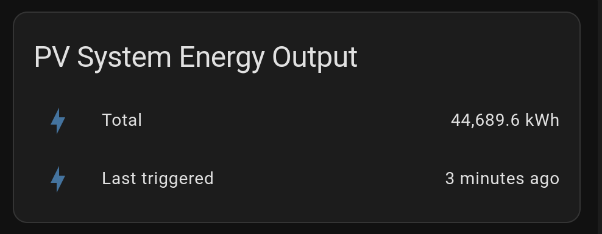

Do you have a sensor that is regularly `unavailable` on your Home Assistant Dashboard, but you'd like to see what the last measured value was?

Here is how to retain the value.

## TL;DR

1. Create a [template sensor](https://www.home-assistant.io/integrations/template/).
2. Update the template sensor's value with a [trigger](https://www.home-assistant.io/docs/automation/trigger/).
3. Add an [entities card](https://www.home-assistant.io/dashboards/entities/) to your dashboard for the new template sensor.

## Worked example

Let's look at a worked example for a PV inverter. This inverter has an energy meter that measures the total energy produced by the inverter over it's lifetime. However, at night time the inverter switches off and the sensor value becomes `unavailable`.

### Create a template sensor

We create a new template sensor with the line `template:`.

Next, setup a `trigger:`. This updates the template sensor everytime the **state** of the PV Inverter's sensor is updated, but specifically excludes the **states** `unknown` and `unavailable`. Also note that there is no trigger for `platform: homeassistant` `event: start`, so the value does not change when home assistant is started.

The template sensor's `state` (i.e. value) is derived from the `state` of `sensor.pv_inverter_energy_total` (i.e. value of the PV inverter's sensor). The [JINJA templating expression](https://www.home-assistant.io/docs/configuration/templating/) is `{{ trigger.to_state.state }}`.

The template sensor's **secondary_info** `last_changed` is updated when home assistant is started. So we will create our own **attribute** `last_triggered` to retain the value after a reboot. You may have noticed that only Automations and Scripts[^1] have `last-triggered` in their **secondary_info**, we'll mimic this data as an **attribute**. We return a string of date, time, and UTC offset to the corresponding time zone in the ISO 8601 format.

``` yaml
# This sensor should hold it's value until the next time the state is available
---
template:
  trigger:
    - platform: state
      entity_id: sensor.pv_inverter_energy_total
      not_to:
        - 'unknown'
        - 'unavailable'
  sensor:
    - name: pv_system_energy_output_total_persistent
      device_class: energy
      state_class: total_increasing
      unit_of_measurement: kWh
      state: >-
        {{ trigger.to_state.state }}
      attributes: 
        last_triggered: >-
          {{ (trigger.to_state.last_changed|as_local).isoformat() }}
```

## Add an Entities card to your dashboard

Through the UI add an entities card for our new sensor. The `entity` can be added through the UI but not the `attribute`. Click SHOW CODE EDITOR to see the yaml configuration.

``` yaml
type: entities
title: PV System Energy Output
entities:
  - entity: sensor.pv_system_energy_output_total_persistent
    name: Total
  - type: attribute
    entity: sensor.pv_system_energy_output_total_persistent
    attribute: last_triggered
    format: relative
    name: Last triggered

```



Did you notice that the `last_triggered` attribute was automatically converted from ISO 8601 format to a `relative` `format:` "3 minutes ago".

## Conclusion

I hope this helps you make your dashboards more usable.

Other example sensors where this solution could be used:

* A level sensor on a remote tank that updates it's level infrequently because the water level is not changing or the device is sleeping to reduce battery consumption.

Please feel welcome to leave a comment below.

[^1]: "As of Home Assistant Core 2024.8, only Automations and Scripts have `last-triggered` in their **secondary_info**."
