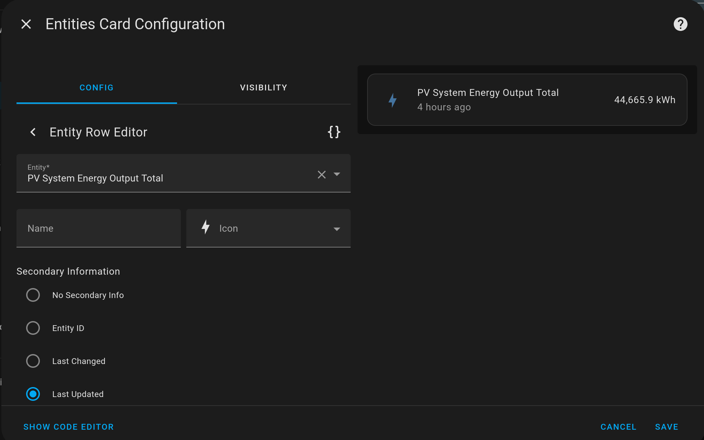

Do you have a sensor that is regularly `unavailable` on your Home Assistant Dashboard, but you'd like to see what the last measured value was?

Here is how to retain value.

## TL;DR

1. Create a [template sensor](https://www.home-assistant.io/integrations/template/).
2. Update the template sensor's value with a trigger.
3. Add an Entities card to your dashboard for the new template sensor.

## Worked example

Let's look at a worked example for a PV inverter. This inverter has an energy meter that measures the total energy produced by the inverter over it's lifetime. However, at night time the inverter switches off and the sensor value becomes `unavailable`.

### Create a template sensor

We create a new template sensor with the `template:` line.

Next, setup a `trigger:` that updates the template sensor everytime the `state` of the PV Inverter's sensor is updated, but specifically exclude the `state`s `unknown` and `unavailable`. Also note that there is no trigger for `homeassistant` `event:` `start`, so the value does not change when home assistant is started, and the value should be retained after a reboot.

The template sensor's `state` is derived from `sensor.pv_inverter_energy_total` using a [JINJA templating expression](https://www.home-assistant.io/docs/configuration/templating/) `{{ trigger.to_state.state }}`.

As of Home Assistant Core 2024.8, only Automations have `last_triggered` in their `attributes`. As a bonus, we can create our own `last_triggered` that mimics the Automation's `attribute`. We return a string of date, time, and UTC offset to the corresponding time zone in ISO 8601 format.

``` yaml
# This sensor should hold it's value until the next time the state is available
---
template:
  trigger:
    - platform: state
      entity_id: sensor.pv_inverter_energy_total
      not_to:
        - 'unknown'
        - 'unavailable'
  sensor:
    - name: pv_system_energy_output_total_persistent
      device_class: energy
      state_class: total_increasing
      unit_of_measurement: kWh
      state: >-
        {{ trigger.to_state.state }}
      attributes: 
        last_triggered: >-
          {{ (trigger.to_state.last_changed|as_local).isoformat() }}
```

## Add an Entities card to your dashboard

Through the UI:



Click SHOW CODE EDITOR to see the yaml.

``` yaml
type: entities
entities:
  - entity: sensor.pv_system_energy_output_total_persistent
    secondary_info: last-updated
```

## Conclusion

I hope this helps you make your dashboards more usable.

Other examples where this solution could be used:

* A level sensor on a remote tank that updates it's level infrequently to reduce battery consumption.

Please feel welcome to leave a comment below.
